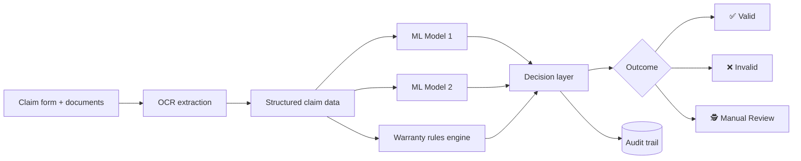

<div align="center">

# 🛡️ AssureX Claim Engine

### AI-powered warranty claim validation, with evidence for every decision


**Team SFC-BitPy** · Abdul Rafay · Hifza Aziz · Veeraj Kumar · Muhammad Umer

</div>

---

## ✨ At a Glance

| | |
|---|---|
| **Problem** | Warranty claims are reviewed by hand: slow, inconsistent, and hard to audit. |
| **Solution** | Upload the documents, and the engine extracts, scores, checks rules, and decides. |
| **Decisions** | ✅ Valid · ❌ Invalid · 🕵️ Manual Review Required |
| **Differentiator** | Every decision ships with supporting evidence, opposing factors, rule outcomes, and an audit trail. |

---

## 📑 Table of Contents

1. [Overview](#-overview)
2. [Architecture](#-architecture)
3. [Tech Stack](#-tech-stack)
4. [Folder Structure](#-folder-structure)
5. [Installation](#-installation)
6. [Database Setup](#-database-setup)
7. [Configuration](#-configuration)
8. [Running the Application](#-running-the-application)
9. [Usage Guide](#-usage-guide)
10. [Machine Learning Models](#-machine-learning-models)
11. [Dataset](#-dataset)
12. [Testing](#-testing)
13. [Troubleshooting](#-troubleshooting)
14. [Known Limitations](#-known-limitations)
15. [Future Enhancements](#-future-enhancements)
16. [AI Tool Usage](#-ai-tool-usage)
17. [License](#-license)

---

## 📖 Overview

**AssureX Claim Engine** is a web-based warranty claim validation system that automates the evaluation of warranty claims for manufacturers and service centers.

The system:

1. **Collects** claim details and supporting documents
2. **Extracts** data from uploaded receipts and warranty cards using OCR
3. **Evaluates** the claim with two independent machine learning models
4. **Validates** it against configurable warranty rules
5. **Decides** and explains the outcome

### Possible Outcomes

| Decision | Meaning |
|---|---|
| ✅ **Valid Claim** | Meets all warranty conditions |
| ❌ **Invalid Claim** | Violates a warranty rule |
| 🕵️ **Manual Review Required** | Needs a human reviewer |

Every decision includes **supporting evidence**, **opposing factors**, **rule outcomes**, and a full **audit trail**.

---

## 🏗️ Architecture



> 📝 **TODO:** Confirm this diagram matches your real flow (e.g., do the two models and rules run in parallel or in sequence? How are disagreements routed to Manual Review?). Add a one-paragraph description per component below.

| Component | Responsibility |
|---|---|
| **Claim intake** | TODO |
| **OCR module** | Extracts fields from receipts and warranty cards |
| **ML models (x2)** | Two independent assessments of claim validity |
| **Rules engine** | Applies configurable warranty conditions |
| **Decision layer** | Combines model and rule outputs into one of three outcomes |
| **Audit log** | Records evidence, opposing factors, rule results, and timestamps |

---

## 🧰 Tech Stack

> 📝 **TODO:** Fill in the real versions.

| Layer | Technology |
|---|---|
| Frontend | TODO |
| Backend | TODO |
| Database | TODO |
| OCR | TODO |
| ML | TODO |

---

## 📂 Folder Structure

```text
assurex-claim-engine/
├── TODO: paste output of `tree -L 2 -I "node_modules|__pycache__|venv"`
└── README.md
```

---

## ⚙️ Installation

**Prerequisites**

- TODO: Python / Node version
- TODO: OCR engine binary (if any)
- TODO: Database server

```bash
# 1. Clone
git clone <your-repo-url>
cd assurex-claim-engine

# 2. Install dependencies
# TODO: replace with your real commands
pip install -r requirements.txt
```

---

## 🗄️ Database Setup

```bash
# TODO: schema creation / migration / seed commands
```

---

## 🔧 Configuration

Create a `.env` file in the project root:

```env
# TODO: list every variable your app reads
# DATABASE_URL=
# SECRET_KEY=
# UPLOAD_DIR=
```

> ⚠️ Never commit `.env`. Add it to `.gitignore`.

---

## ▶️ Running the Application

```bash
# TODO: start command(s)
```

Then open **http://localhost:PORT** (TODO: port).

---

## 🧭 Usage Guide

1. **Submit a claim.** Enter product, purchase, and issue details.
2. **Upload documents.** Attach the receipt and warranty card.
3. **Review extraction.** Check the fields OCR pulled from your documents.
4. **Get a decision.** See the outcome plus supporting evidence, opposing factors, and rule results.
5. **Audit.** Open the audit trail for the full history of the decision.

> 📝 **TODO:** Add 2–3 screenshots here. Screenshots are the single highest-impact addition to a README.
>
> ``
> ``

---

## 🤖 Machine Learning Models

The engine uses **two independent models** so that a single model's blind spot cannot decide a claim alone.

| | Model 1 | Model 2 |
|---|---|---|
| **Algorithm** | TODO | TODO |
| **Inputs** | TODO | TODO |
| **Output** | TODO | TODO |
| **Accuracy / F1** | TODO | TODO |

**Decision logic:** TODO (e.g., both models agree and all rules pass → Valid; rule violation → Invalid; disagreement or low confidence → Manual Review).

---

## 📊 Dataset

| Property | Detail |
|---|---|
| Source | TODO (real, synthetic, or mixed?) |
| Size | TODO |
| Features | TODO |
| Train / test split | TODO |

---

## 🧪 Testing

```bash
# TODO: test command
```

---

## 🩺 Troubleshooting

| Problem | Fix |
|---|---|
| OCR returns empty text | TODO |
| Database connection fails | TODO |
| Model file not found | TODO |

---

## ⚠️ Known Limitations

- TODO: e.g., OCR accuracy on blurry or handwritten receipts
- TODO: e.g., dataset size or synthetic data
- TODO: e.g., supported languages and document formats

---

## 🚀 Future Enhancements

- [ ] TODO: e.g., multilingual OCR
- [ ] TODO: e.g., fraud and duplicate-claim detection
- [ ] TODO: e.g., reviewer feedback loop to retrain models

---

## 🤝 AI Tool Usage

> 📝 **TODO:** State honestly which AI tools helped and for what (code, docs, data). Competition judges generally look for this section to be specific rather than generic.

---

## 📄 License

TODO: choose a license (e.g., MIT) and add a `LICENSE` file.

---

<div align="center">

Built by **Team SFC-BitPy** for **NextWave: AI-Powered Document Ops**

</div>
