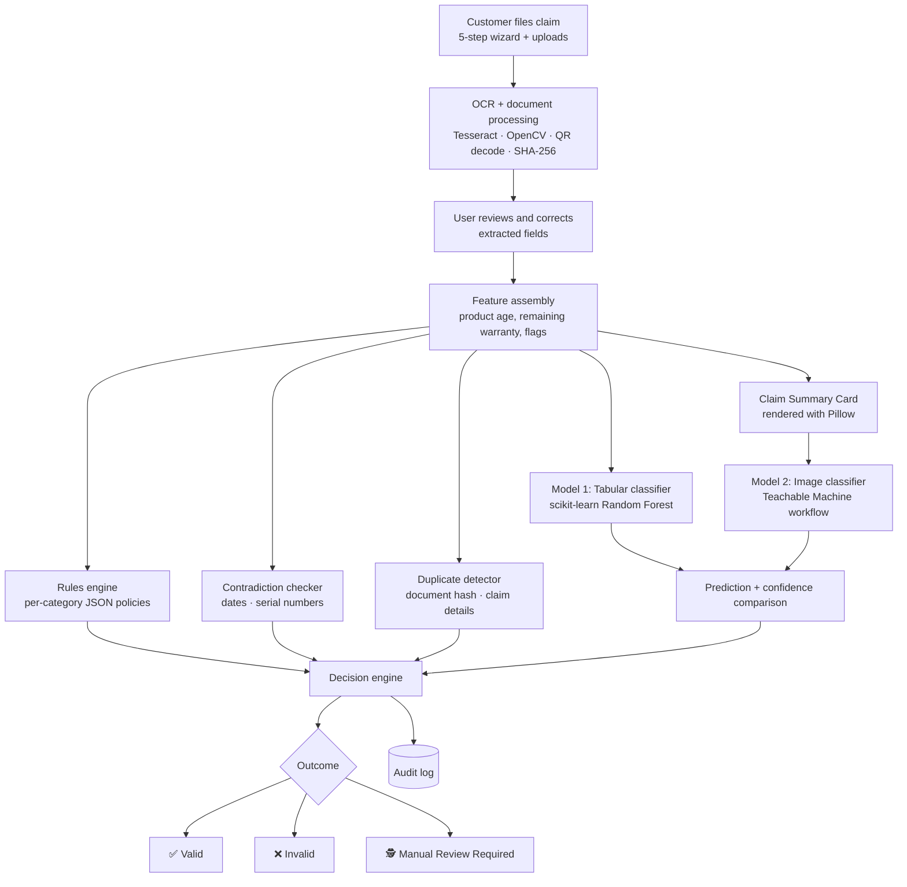

<div align="center">

# 🛡️ AssureX Claim Engine

### AI-powered warranty claim validation, with evidence for every decision


[🌐 Live Demo](https://sfcbitpy.odinno.com) · [💻 GitHub](https://github.com/abdul-rafay-dev0/AssureX-Warranty-Claim-Engine) · [📝 Technical Blog](https://assurexclaimengine00.blogspot.com/2026/09/assurex-claim-warranty-engine.html)

**Team SFC-BitPy** · Abdul Rafay · Hifza Aziz · Veeraj Kumar · Muhammad Umer

NextWave AI and ML — AI-Powered Document Ops · Version 1.0

</div>

---

## ✨ At a Glance

| | |
|---|---|
| **Problem** | Manual warranty review is slow, inconsistent, and easy to defraud. Wrongly rejecting honest customers and wrongly paying fraudulent claims are both costly. |
| **Solution** | Customers file a claim and upload documents. The engine reads them with OCR, checks business rules, runs **two independent ML models**, compares them, and decides. |
| **Decisions** | ✅ Valid · ❌ Invalid · 🕵️ Manual Review Required |
| **Differentiator** | Confident cases are automated. Ambiguous cases, including any **disagreement between the two models**, go to a human. Every decision carries evidence and an audit trail. |

---

## 🌐 Live Application

| Resource | Link |
|---|---|
| **Live URL** | [https://sfcbitpy.odinno.com](https://sfcbitpy.odinno.com) |
| **GitHub Repository** | [https://github.com/abdul-rafay-dev0/AssureX-Warranty-Claim-Engine](https://github.com/abdul-rafay-dev0/AssureX-Warranty-Claim-Engine) |
| **Technical Blog** | [https://assurexclaimengine00.blogspot.com/2026/09/assurex-claim-warranty-engine.html](https://assurexclaimengine00.blogspot.com/2026/09/assurex-claim-warranty-engine.html) |

---

## 📑 Table of Contents

1. [Overview](#-overview)
2. [Architecture](#-architecture)
3. [Tech Stack](#-tech-stack)
4. [Folder Structure](#-folder-structure)
5. [Installation](#-installation)
6. [Database Setup](#-database-setup)
7. [Configuration](#-configuration)
8. [Running the Application](#-running-the-application)
9. [Usage Guide](#-usage-guide)
10. [Machine Learning Models](#-machine-learning-models)
11. [Dataset](#-dataset)
12. [Testing](#-testing)
13. [Troubleshooting](#-troubleshooting)
14. [Known Limitations](#-known-limitations)
15. [Future Enhancements](#-future-enhancements)
16. [AI Tool Usage](#-ai-tool-usage)
17. [License](#-license)

---

## 📖 Overview

**AssureX Claim Engine** is a web-based warranty claim validation system that automates the evaluation of warranty claims for manufacturers and service centers.

The system collects claim details and supporting documents, extracts data from uploaded receipts and warranty cards using OCR, evaluates the claim using two independent machine learning models, validates it against configurable warranty rules, and produces one of three final decisions:

| Decision | Meaning |
|---|---|
| ✅ **Valid Claim** | Meets all warranty conditions |
| ❌ **Invalid Claim** | Violates a warranty rule |
| 🕵️ **Manual Review Required** | Needs a human reviewer |

Every decision includes **supporting evidence**, **opposing factors**, **rule outcomes**, and a full **audit trail**.

---

## 🏗️ Architecture

The backend, rules, and model layers are separate, so each can be tested and changed on its own.



### Components

| Component | Responsibility |
|---|---|
| **Claim intake** | Customers register products and file claims through a five-step wizard, uploading receipt, warranty card, damage photo, and serial photo. |
| **OCR module** | Reads text with Tesseract after OpenCV preprocessing (grayscale, bilateral filter, adaptive threshold). Runs on both the cleaned and the raw image and keeps the better result. Decodes QR codes. Regex extracts purchase date, invoice number, product, model, serial, retailer, amount, and warranty duration. |
| **Rules engine** | Checks warranty status, excluded damage, mandatory documents, authorized repairs, reporting window, and prior replacement, using JSON policy files per product category. |
| **Contradiction checker** | Flags inconsistent dates and serial numbers. |
| **Duplicate detector** | Compares SHA-256 document hashes and claim details. |
| **ML models (x2)** | A tabular classifier and an image classifier assess the same claim independently. |
| **Decision engine** | Combines rule findings, model outputs, and the model comparison into one outcome, then writes the audit log. |
| **Audit log** | Stores raw predictions, confidences, rule findings, and a human-readable summary for every claim. |

### Roles

The API uses JWT authentication with four roles: **customer**, **service-centre employee**, **reviewer**, and **administrator**.

---

## 🧰 Tech Stack

| Layer | Technology |
|---|---|
| **Frontend** | React (single-page app), Vite, Bootstrap, interactive charts |
| **Backend** | Python, FastAPI, SQLAlchemy ORM, JWT auth with role-based access |
| **Database** | MySQL |
| **OCR / vision** | Tesseract, OpenCV, QR decoding, Pillow (summary-card rendering) |
| **ML** | scikit-learn (pipelines, Random Forest, Logistic Regression), XGBoost, CNN and ResNet18 image classifiers (Keras / TensorFlow Lite export), joblib |
| **Storage** | Uploaded files on disk, referenced in the database. Versioned model artifacts |

> Exact package versions: see `requirements.txt` and `package.json` in the repository.

---

## 📂 Folder Structure

```text
AssureX-Warranty-Claim-Engine/
│
├── Source Code/                          # Core ML pipeline
│   ├── data/
│   │   └── processed/                    # Train / validation / test CSVs
│   │       ├── train.csv
│   │       ├── val.csv
│   │       └── test.csv
│   ├── model/                            # Trained model artifacts
│   │   └── python_claim_model.pkl
│   └── src/                              # Source scripts
│
├── Deployed Application/                 # Frontend + Backend (React + FastAPI)
├── Dataset/                              # Raw and processed data
├── Python Classification Model Evidence/
├── Project Report/
├── Test Case/
├── Execution Instruction/
├── Installation Instruction/
├── Warranty Policy/
├── Model Prediction/
├── AI Usage/
├── Technical Blogger/
├── Video/
├── Github Repository/
│
├── .gitattributes
├── LICENSE
└── README.md
```

---

## ⚙️ Installation

**Prerequisites**

- Python 3.x
- Node.js and npm
- MySQL server
- Tesseract OCR installed and on your `PATH`

```bash
# 1. Clone
git clone https://github.com/abdul-rafay-dev0/AssureX-Warranty-Claim-Engine.git
cd AssureX-Warranty-Claim-Engine

# 2. Backend dependencies (run where requirements.txt lives)
cd "Deployed Application/backend"
pip install -r requirements.txt

# 3. Frontend dependencies
cd "../frontend"
npm install
```

Step-by-step guides are also in the `Installation Instruction` and `Execution Instruction` folders.

---

## 🗄️ Database Setup

The backend uses SQLAlchemy over **MySQL**.

```bash
# Create the database
mysql -u <user> -p -e "CREATE DATABASE <db_name>;"
```

Tables are created by the backend's SQLAlchemy models. See `Installation Instruction` for the exact initialization step.

---

## 🔧 Configuration

Create a `.env` file in the backend directory:

```env
DATABASE_URL=mysql+pymysql://<user>:<password>@localhost:3306/<db_name>
SECRET_KEY=<long-random-string>
UPLOAD_DIR=<path-for-uploaded-documents>
```

**Behavior settings** (configurable, no retraining needed):

| Setting | Default | Effect |
|---|---|---|
| Strong Match | confidence difference ≤ 0.10 | Both models agree strongly |
| Acceptable Match | confidence difference ≤ 0.20 | Reasonable agreement |
| Weak Match | confidence difference > 0.20 | Low agreement |
| Uncertain | highest confidence < 0.60 | Flagged as uncertain |
| Warranty policies | JSON per product category | Duration, covered and excluded faults, mandatory documents, reporting window, repair-history limit |

> ⚠️ Never commit `.env`. Keep it in `.gitignore`.

---

## ▶️ Running the Application

```bash
# Backend (from the backend folder; adjust the module path if your entry point differs)
uvicorn app.main:app --reload

# Frontend (in a second terminal)
cd "Deployed Application/frontend"
npm run dev
```

Both ML models load once at server start-up and are cached in memory, so later requests stay fast.

---

## 🧭 Usage Guide

1. **Open the app.** Use https://sfcbitpy.odinno.com or run it locally.
2. **Register a product** and its warranty details.
3. **File a claim** through the five-step wizard.
4. **Upload documents:** receipt, warranty card, damage photo, serial photo.
5. **Review extracted fields.** Correct any OCR mistakes. Your corrections take priority over raw OCR output.
6. **Get a decision:** Valid, Invalid, or Manual Review Required, with evidence, opposing factors, and rule outcomes.
7. **Reviewers** work the queue of manual-review claims and see model outputs, rule results, and explanations in one place.
8. **Administrators** view analytics and the audit log.

---

## 🤖 Machine Learning Models

Two models look at the same claim from different angles, so one model's blind spot cannot decide a claim alone.

| | **Model 1: Tabular** | **Model 2: Image** |
|---|---|---|
| **Approach** | scikit-learn pipeline (preprocessing + classifier saved as one joblib artifact) | CNN trained with the Google Teachable Machine workflow; ResNet18 transfer learning tried as an alternative |
| **Input** | Structured features: product age, remaining warranty months, purchase price, repair history, document and contradiction flags, product category, fault type | **Claim Summary Card** image rendered from the claim's facts |
| **Output** | Class + probability for each of 3 classes | Softmax probability for each of 3 classes |
| **Selected model** | Random Forest (300 trees, balanced class weights) | See the [technical blog](https://assurexclaimengine00.blogspot.com/2026/09/assurex-claim-warranty-engine.html) |
| **Test accuracy** | ~96% | See the technical blog |

### Algorithm comparison (tabular, identical preprocessing)

| Algorithm | Test accuracy |
|---|---|
| **Random Forest** (selected) | ~96.0% |
| XGBoost | ~95.9% |
| Logistic Regression | ~95.1% |

Random Forest was chosen for the best balance of accuracy and robustness, and for well-behaved probability estimates. The manual-review class was the hardest to separate, because those claims sit deliberately between valid and invalid.

### Claim Summary Card

The image model never touches the raw database. Each claim is rendered as a standardized card showing product category, product age, warranty duration, remaining warranty, fault type, repair count, serial-match status, purchase price, and badges for which documents were attached. Cards **exclude** any prediction, confidence, or decision. The same renderer builds the training set and serves live claims, so both see the same visual distribution.

Training uses resizing, small rotations, brightness and contrast jitter, and ImageNet normalization. There is **no horizontal flipping**, because mirrored text destroys meaning.

### How the decision is made

1. **Compare predicted classes.** If the models disagree, the claim goes to **Manual Review Required**.
2. **Compare confidence.** Match status is Strong, Acceptable, or Weak, or Uncertain if the top confidence is below 0.60.
3. **Apply the rules.** Hard failures (expired warranty, excluded damage) force **Invalid** regardless of the models. Softer issues push toward **Manual Review**.
4. **Both models agree, confidence is good, and all rules pass** gives **Valid**.
5. **Log everything** to the audit trail.

Comparison statuses: `Strong Match` · `Acceptable Match` · `Weak Match` · `Model Disagreement` · `Uncertain Result`.

---

## 📊 Dataset

No public warranty-claim dataset exists, so the team **generated a synthetic corpus**.

| Property | Detail |
|---|---|
| **Source** | Synthetic, from 40 scenario templates across 3 families |
| **Size** | 150,000 claims, split evenly across 3 classes |
| **Split** | Stratified 70 / 15 / 15 (train / validation / test) |
| **Image data** | 30,000 Claim Summary Card images rendered from the same records |
| **Consistency** | The tabular CSV and card images derive from the same records, so both models reason about identical claims |
| **Validation** | Every record checked for class balance, date consistency, and absence of leakage columns |

**Scenario families**

- **Valid:** active warranty, covered fault, complete documents
- **Invalid:** expired warranty, excluded damage (liquid, physical impact), unauthorized repairs, missing proof of purchase
- **Manual review:** borderline expiry, serial mismatch, contradictory dates, missing documents

### Lesson learned: label leakage

Early claim IDs encoded the class in a prefix letter. Because the ID was printed on every card, the image model learned to read the ID instead of the claim, which inflated accuracy and failed on real claims. The team found it by holding features constant and changing only the ID, removed the ID from the cards, and retrained. Accuracy fell but became honest.

---

## 🧪 Testing

- The confidence-comparison logic is unit-tested at every boundary, including the exact threshold values.
- Tabular candidates were evaluated on a held-out test set with per-class confusion matrices.
- Test cases and evidence are in the `Test Case` and `Python Classification Model Evidence` folders.

---

## 🩺 Troubleshooting

| Problem | Cause and fix |
|---|---|
| OCR misses text on a dim or uneven receipt | The engine already tries cleaned and raw images. Correct the fields manually in the review step, because your values override OCR. |
| Tesseract not found | Install Tesseract and make sure it is on your `PATH`. |
| Database connection fails | Check `DATABASE_URL` in `.env` and that the MySQL server is running. |
| Model file not found | Confirm `python_claim_model.pkl` exists under `Source Code/model/`. |
| Card renderer fails with a font error on Linux or macOS | Known issue: the renderer has hardcoded Windows font paths. Point it to an installed font. |
| Claim keeps going to Manual Review | Expected when the two models disagree or confidence is below 0.60. Check the comparison status on the claim. |

---

## ⚠️ Known Limitations

- **Synthetic data.** Reported accuracy comes from synthetic claims, so real-world performance is unverified.
- **Manual-review class** is the hardest to classify by design.
- **Novel inputs.** The image model can be confused by categories or fault words never seen in training.
- **Tabular model** occasionally predicts valid for excluded damage when the damage flag is weak. The rules engine acts as the safety net.
- **CPU-only training** limited image-model iteration.
- **Windows font paths** in the card renderer reduce portability.
- **OCR** remains the most error-prone step, which is why a human corrects extracted fields before evaluation.

---

## 🚀 Future Enhancements

- [ ] Enrich the dataset with real, anonymised claims
- [ ] Calibrate confidence scores
- [ ] Active learning: feed reviewer decisions back into training
- [ ] Remove hardcoded Windows font paths
- [ ] Cross-platform, configuration-driven card rendering

---

## 🤝 AI Tool Usage

| Tool | Used for |
|---|---|
| Google Teachable Machine workflow | Training and exporting the image classifier |
| scikit-learn, XGBoost, TensorFlow / Keras | Training and evaluating the models |
| Gemini | AI assistant for code, documentation, and dataset generation |
| Claude (Anthropic) | Drafting and structuring this README |

Full details are in the `AI Usage` folder.

---

## 📄 License

Released under the **MIT License**. See [LICENSE](LICENSE).

---

<div align="center">

Built by **Team SFC-BitPy** for **NextWave: AI-Powered Document Ops**<br>
[Live Demo](https://sfcbitpy.odinno.com) · [Repository](https://github.com/abdul-rafay-dev0/AssureX-Warranty-Claim-Engine) · [Technical Blog](https://assurexclaimengine00.blogspot.com/2026/09/assurex-claim-warranty-engine.html)

</div>
